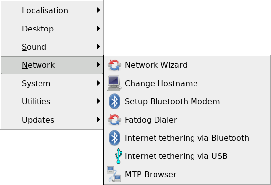

# Scripts To Go

_Are you sated?_

I develop my scripts mostly for _Fatdog64 Linux_, a _Puppy Linux_ derivative.[1]

They are written to be compatible with the POSIX-compliant _ash_ shell, which comes with busybox. The she-bang line is generically set as `#!/bin/sh` to simplify packaging across Linux variants. For scripts that require features of a specific shell, the she-bang is set to reflect which shell, i.e. `#!/bin/bash`.

These scripts assume the GNU version of various shell commands, and GTK2+ as the GUI toolkit.

Unless otherwise noted, they are licensed under the GNU GPLv3 license.

[1] Since version 700, Fatdog64 is built from _Linux From Scratch (LFS)_, and maintains excellent compatibility with Puppy Linux.

### gmenu2

An application menu.
 
 * Installing: `install/install-gmenu2.sh`. See also _gmenu2-fdcp_.
 * Extension: If gmenu2 finds script `gmenu2-fdcp` somewhere in the `PATH`
   it automatically adds menu entries for all Fatdog64 control panel items.
 * Dependencies: [my gtkmenuplus fork](https://github.com/step-/gtkmenuplus)
 * Help: Hover over menu entries for tooltip help.
 * Thanks: Gmenu2 was inspired by SFR's GMenu script.
 * Screenshot: Note the typical Puppy Linux application sub-menus, and
   the additional 'Wine', 'Uncategorized', 'Recent', and 'Gmenu2' sub-menus.
   'Recent' tracks item and launcher activations for quick re-use.
 * 

### gmenu2-fdcp

Fatdog64 Control Panel as a menu

 * Installing: `install/install-gmenu2-fdcp.sh`
 * Dependencies: [my gtkmenuplus fork](https://github.com/step-/gtkmenuplus)
 * Help: `gmenu2-fdcp --help`
 * This script works stand-alone or as an embeddable module. See also gmenu2.
 * Screenshot: Fatdog64 control menu with default large font and 32
   pixel icons.  Smaller font and icons can be set by editing the script.
 * 

### roxmm

A ROX-Filer SendTo menu look-alike.
 
 * Installing: `install/install-roxmm.sh`
 * Dependencies: [my gtkmenuplus fork](https://github.com/step-/gtkmenuplus)
 * Help: `roxmm --help`
 * Screenshot: Right - rox SendTo menu. Left - corresponding roxmm menu. Note tooltip and Tools menu.
 * 
