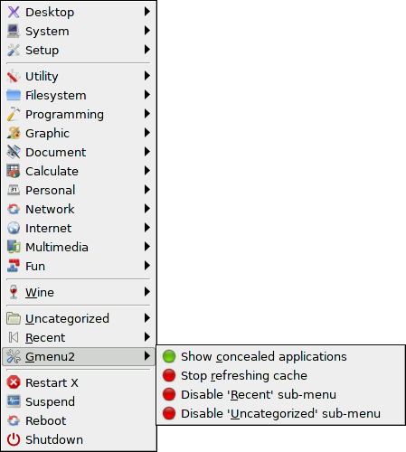
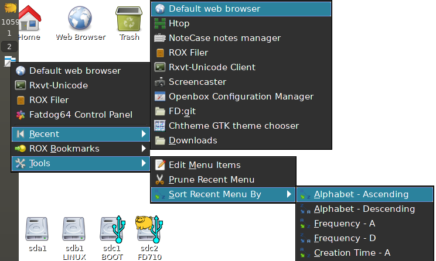
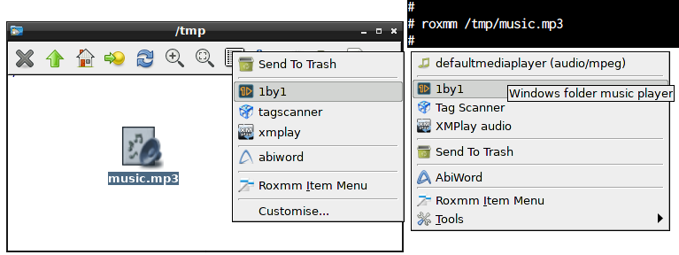

# Scripts To Go

_Are you sated?_

I develop my scripts mostly for _[Fatdog64
Linux](http://distro.ibiblio.org/fatdog/web/)_,
a _[Puppy Linux](http://puppylinux.com/)_ derivative.[1]

They are written to be compatible with the POSIX-compliant _ash_ shell,
which comes with busybox. The she-bang line is generically set as
`#!/bin/sh` to simplify packaging across Linux variants. For scripts
that require features of a specific shell, the she-bang is set to
reflect the required shell, i.e. `#!/bin/bash`.

These scripts assume that the GNU versions of various shell commands are
installed, and that GTK2+ is the GUI toolkit.

Unless otherwise noted, these scripts are licensed under the GNU GPLv3
license.

[1] Fatdog64-7xx is built from _Linux From Scratch (LFS)_, and maintains
excellent compatibility with Puppy Linux.

----

### gmenu2

Fatdog64 System and Application Menu

**Usage Scenarios**

 * Replacing the out-of-the-box Fatdog64 System menu because you don't
   use the Openbox and JWM window managers.
 * Displaying the system menu with a global hotkey.

**Installing**

 * Download and unpack the repository snapshot [tar file](https://github.com/step-/scripts-to-go/archive/master.tar.gz).
 * Run `install/install-gmenu2.sh` from the unpacked folder.
   `--help` is a command-line option.
 * Optionally set a global hotkey to activate the menu.
   For the _Sven_ keyboard manager: open the Preferences dialog, select
   **Keyboard**, **New** **Description** _System Menu_ **Key code**
   _Win+s_ **Runs** Program _gmenu2_.
 * See also script _gmenu2-fdcp_ in this repository.

**Extensions**

If gmenu2 finds script `gmenu2-fdcp` somewhere in the `PATH` it
automatically adds menu entries for all Fatdog64 control panel items.

**Dependencies** - [gtkmenuplus](https://github.com/step-/gtkmenuplus) fork.

**Help** - Hover over menu entries for tooltip help.

**Thanks** - Gmenu2 was inspired by SFR's GMenu script.

**Screenshot**

Note the typical Puppy Linux system sub-menus, and the additional
'Wine', 'Uncategorized', 'Recent', and 'Gmenu2' sub-menus.  'Recent'
automatically tracks item and launcher activations for quick re-use.
Recent items are shared with _quicklaunch_, another menu script in this
repository.



----

### gmenu2-fdcp

Fatdog64 Control Panel As a Menu

**Usage Scenarios**

 * Quickly viewing and running the many system functions that the
   Fatdog64 Control Panel provides.
 * Displaying a Control Panel menu with a global hotkey.

**Installing**

 * Download and unpack the repository snapshot [tar file](https://github.com/step-/scripts-to-go/archive/master.tar.gz).
 * Run `install/install-gmenu2-fdcp.sh` from the unpacked folder.
   `--help` is a command-line option.
 * Optionally set a global hotkey to activate the menu.
   For the _Sven_ keyboard manager: open the Preferences dialog, select
   **Keyboard**, **New** **Description** _Control Panel Menu_ **Key code**
   _Win+p_ **Runs** Program _gmenu2-fdcp_.
 * This script works stand-alone and also as an embeddable module in
   another gtkmenuplus menu. See script _gmenu2_ in this repository.

**Dependencies** - [gtkmenuplus](https://github.com/step-/gtkmenuplus) fork.

**Help** - `gmenu2-fdcp --help`

**Screenshot**

Fatdog64 control menu with default large font and 32-pixel icons.
Smaller font and icons can be set by editing the script.


----

### quicklaunch

Customizable Desktop Panel and User Menu

**Usage Scenarios**

 * Condensing Fatdog64 Desktop Panel icons into a single icon to free
   some Panel real estate.
 * Displaying a quick-launch menu with a global hotkey.
 * Automatically tracking your command usage for quick re-use.
 * Keeping all customized commands in a single text file.

**Installing**

 * Download and unpack the repository snapshot [tar file](https://github.com/step-/scripts-to-go/archive/master.tar.gz).
 * Run `install/install-quicklaunch.sh` from the unpacked folder.
   `--help` is a command-line option.
 * Optionally set a global hotkey to activate the menu.
   For the _Sven_ keyboard manager: open the Preferences dialog, select
   **Keyboard**, **New** **Description** _Quicklaunch Menu_ **Key code**
   _Win+x_ **Runs** Program _/root/quicklaunch.gtkmenuplus_.

Optionally, replace multiple Desktop Panel icons with a single icon that
starts the quicklauch menu. Instructions for LXQt Panel users:
Edit file _~/.config/lxqt/panel.conf_.  If you don't have this
file, copy the system default file _/etc/xdg/lxqt/panel.conf_ to
_~/.config/lxqt/panel.conf_ then edit the latter.  Look for section
`[quicklaunch]`. By default in Fatdog64-710 it looks like this:

```
[quicklaunch]
type=quicklaunch
apps/size=4
apps\1\desktop=/usr/share/applications/default-browser.desktop
apps\2\desktop=/usr/share/applications/urxvt.desktop
apps\3\desktop=/usr/share/applications/rox.desktop
apps\4\desktop=/usr/share/applications/fatdog-control-panel.desktop
```

It may look differently on your system if you have customized your LXQt
panel.  Change the above to:

```
[quicklaunch]
type=quicklaunch
apps\size=1
apps\1\desktop=/root/.local/share/applications/quicklaunch.desktop
```

Then restart X for the changes to take effect. Now your LXQt panel
should include just one icon, and when you click it a menu for the four
default icons that your replaced should be displayed.  Should you want
different menu items edit file _~/quicklaunch.gtkmenuplus_.

If you did add the quicklaunch icon to the Desktop Panel, you may also
want for the menu colors to match the Desktop Panel theme. How to do so
is explained in _~/.local/usr/share/applications/quicklaunch.desktop_,
which sets the Onyx theme by default. If your desktop uses a different
theme edit _quicklaunch.desktop_.  Instructions are given in the file.

**Dependencies** - [gtkmenuplus](https://github.com/step-/gtkmenuplus) fork.

**Help** - Read section `---- Help ----` of file _~/quicklaunch.desktop_.

**Screenshot**

The Quicklaunch Menu icon is installed in LXQt Panel, the vertical bar
on the left side), and replaces the default set of application icons;
Default Web Browser, Rxvt-Unicode, ROX Filer and Fatdog64 Control
Panel. The Panel bar is unincumbered while the default applications
can still be accessed as menu items. Moreover, there is a sub-menu of
ROX Filer bookmarks, and an automatically-updated sub-menu of "Recent"
command invocations. Those are the commands that the user invokes
frequently through Quicklaunch.  In this picture, Quicklaunch sports the
Onyx theme.



----

### roxmm

ROX-Filer SendTo Menu Look-Alike

**Installing**

 * Download and unpack the repository snapshot [tar file](https://github.com/step-/scripts-to-go/archive/master.tar.gz).
 * Run `install/install-roxmm.sh` from the unpacked folder.
   `--help` is a command-line option.

**Dependencies** - [gtkmenuplus](https://github.com/step-/gtkmenuplus) fork.

**Help** - `roxmm --help`

**Screenshot**

Right - rox SendTo menu. Left - corresponding roxmm menu. Note tooltip
and Tools menu.



----
